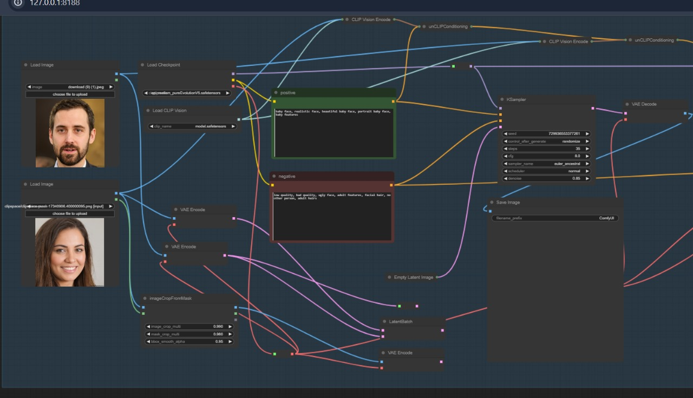
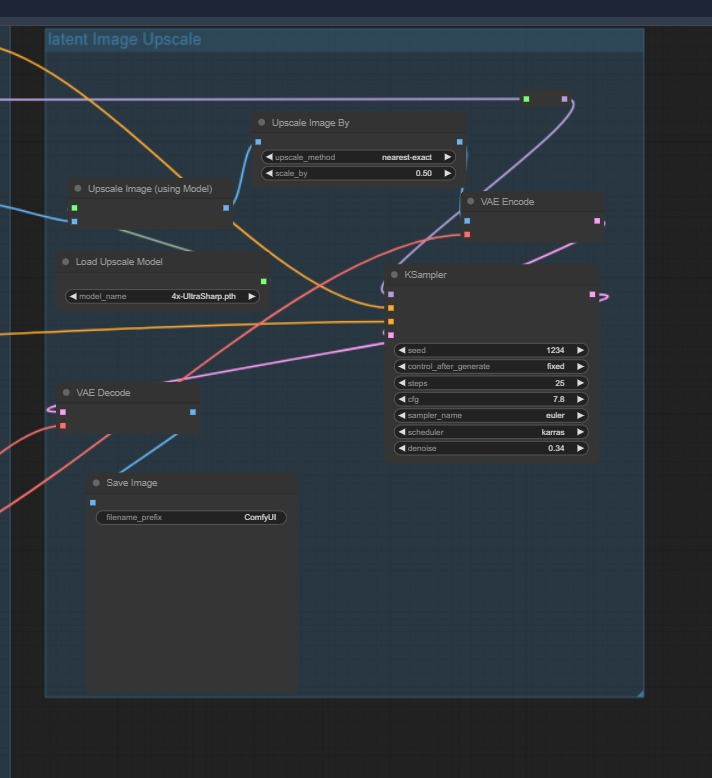
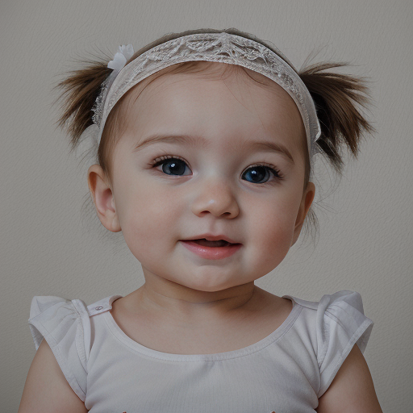

# Parent-To-Baby-Face-AI-Gen

## Project Description

The "Parent-To-Baby-Face-AI-Gen" project uses advanced AI techniques and Stable Diffusion to generate a future baby's face image from images of both parents. The workflow is implemented using ComfyUI and incorporates several powerful models and tools to create realistic baby faces.

## Key Features
- **ComfyUI Workflow**: Custom web UI for seamless interaction and image generation.
- **epiCRealism Model**: Utilized for high-quality image generation, sourced from Civit AI.
- **CLIP Vision Model**: Employed for understanding and processing image content.
- **Ksampler**: Integrated for sampling and refining generated images.
- **Latent Image Upscale**: Enhances image quality and resolution.
- **CLIP Text Prompt**: Used for generating and refining text-based prompts.
- **IPAdapter Model**: Applied to adapt and optimize image processing.
- **VAE Model**: Loaded to enhance generative capabilities and improve image quality.

## Installation
1. Clone the repository:
   ```bash
   git clone https://github.com/yourusername/Parent-To-Baby-Face-AI-Gen.git
2. Drag and drop the workflow file and parent images into the ComfyUI interface to generate the baby face image.
3. Use ComfyUI Manager to install any missing nodes required for the workflow.

## Usage
- Launch the ComfyUI web interface.
- Upload images of the parents.
- Configure model parameters and settings.
- Generate and view the baby face image.

- Feel free to submit issues, suggestions, or pull requests to improve the project.

  For any questions or feedback, please contact mrhimanshu401u@gmail.com.

## Workflow




## Result Images



